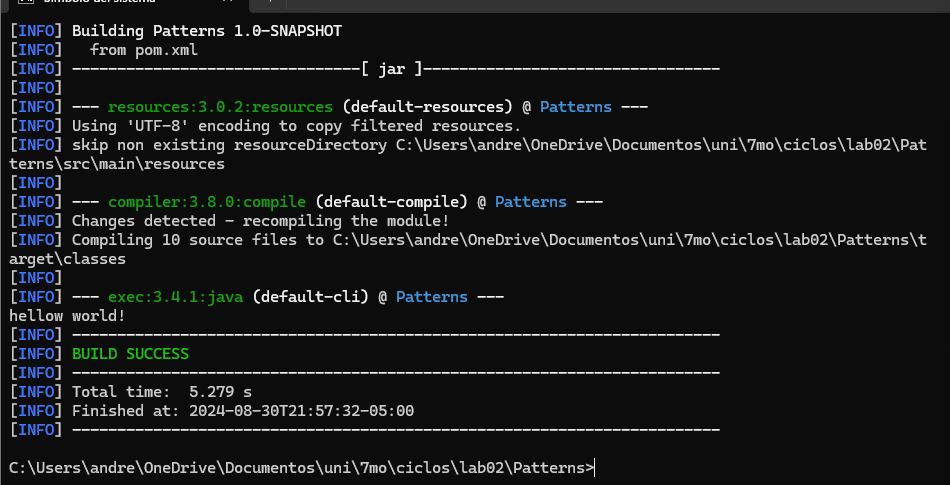

# INTEGRANTES

## La herramienta Maven

### ¿cuál es su mayor utilidad?

Maven facilita la gestión de proyectos Java al proporcionar una estructura estándar y simplificada para el manejo de dependencias, la compilación del código, la ejecución de pruebas, y la generación de documentación. Todo esto se realiza a través de un único archivo de configuración, el pom.xml, lo que hace que el proceso de desarrollo sea más eficiente y organizado.

### Fases de maven

El ciclo de vida de construcción en Maven está compuesto por varias fases, cada una correspondiente a una etapa en el proceso de construcción del proyecto. Las fases más comunes incluyen:

- validate: Verifica que el proyecto esté correctamente configurado.

- compile: Compila el código fuente del proyecto.
- test: Ejecuta pruebas unitarias.

- package: Empaqueta el código compilado en un formato distribuible (por ejemplo, un archivo JAR).
- install: Instala el paquete en el repositorio local para su uso en otros proyectos.
- deploy: Copia el paquete final a un repositorio remoto, haciéndolo accesible para otros desarrolladores.

### Ciclo de vida de la construcción

El ciclo de vida en Maven es una secuencia de fases que se ejecutan de manera ordenada. Maven ofrece tres ciclos de vida predefinidos: default, clean y site. Cada uno de estos ciclos tiene su conjunto de fases. El ciclo de vida por defecto (default) es el más común y abarca desde la validación hasta la implementación del proyecto. Las fases son ejecutadas en el orden que se define dentro de cada ciclo, lo que permite un control granular sobre el proceso de construcción del proyecto.

### Para qué sirven los plugins

Los plugins son esenciales en Maven, ya que definen la funcionalidad específica que se ejecutará durante las distintas fases del ciclo de vida. Por ejemplo, el plugin maven-compiler-plugin se utiliza para compilar el código fuente, y el plugin maven-surefire-plugin se encarga de ejecutar pruebas unitarias. Los plugins pueden ser configurados y personalizados en el archivo pom.xml, permitiendo extender las capacidades de Maven según las necesidades del proyecto.

### ¿Qué es y para qué sirve el repositorio central de maven?

El Repositorio Central de Maven es una colección pública de artefactos, donde se almacenan versiones específicas de bibliotecas y plugins. Cuando se especifica una dependencia en el pom.xml, Maven automáticamente busca y descarga el artefacto correspondiente del repositorio central si no se encuentra en el repositorio local. Esto simplifica enormemente la gestión de dependencias, asegurando que los proyectos siempre tengan acceso a las versiones correctas de las bibliotecas necesarias sin necesidad de descargarlas manualmente.

## instalacion Maven

#### paramentros del proyecto

#### Archivos y directorios creados 

#### cambio de version en java 8

### COMPILAR Y EJECUTAR

#### compilacion del codigo

### ejecutando `App.java`

###### hello world

##### hello zayra

#### ejecutando con parametro nombre y apellido 

El parametro **package**  en Maven se usa para construir y empaquetar el proyecto en un formato específico, como un JAR o un WAR. Este comando ejecuta todas las fases del ciclo de vida de compilación de Maven, hasta la fase de **"package"**, lo que incluye la validación, compilación y creación del paquete del proyecto.

Además de **"package"**, se pueden utilizar otros parámetros en el comando mvn para realizar diferentes tareas. Algunos de los más comunes son:

- compile: Compila el código fuente del proyecto.
- test: Ejecuta las pruebas unitarias utilizando un marco de pruebas adecuado.
- clean: Elimina los archivos generados por compilaciones anteriores.
- install: Construye el proyecto y lo instala en el repositorio local de Maven.
- deploy: Copia el paquete final a un repositorio remoto para compartirlo con otros desarrolladores.

### ¿Cuál fábrica hiciste?
El metodo factory permite delegar la creación de objetos a subclases, liberando al desarrollador de la necesidad de conocer cómo se compone internamente un objeto específico. Este patrón es útil cuando una clase no puede anticipar qué tipo de objeto debe crear, permitiendo que las subclases especifiquen los objetos necesarios.

Es útil cuando una clase no puede determinar el tipo de objeto a crear.
Se utiliza en sistemas grandes y complejos con múltiples patrones creacionales.

###  ¿Cuál es mejor?
Optamos por utilizar el Simple Factory debido a su simplicidad, ya que el problema no demanda una solución más compleja. Con un simple `switch case`, podemos determinar los requerimientos de cada figura de manera eficiente y directa.

### Ejecute múltiples veces la clase ShapeMain, usando el plugin exec de maven con los siguientes parámetros y verifique la salida en consola para cada una:

 **Sin parametros**

+ 

**Parámetro: qwerty**

- 

**Parámetro: pentagon**

- 

**Parámetro: Hexagon**

- 

#### ¿Cuál(es) de las anteriores instrucciones se ejecutan y funcionan correctamente y por qué?

- Todas se ejecutan correctamente pues se tiene operación para todas las posibles entradas.